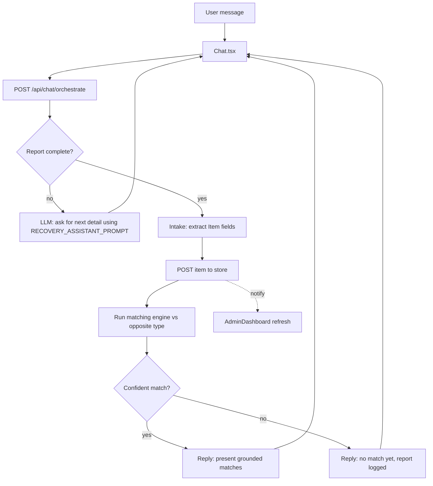

# Design – Chat Pipeline Integration

## Overview

Today the chat is an isolated LLM conversation. This design connects it to the existing intake → store → match pipeline so that the assistant's match statements are grounded in real data, and makes the Admin Dashboard reflect the live store. The work is intentionally scoped for a hackathon: it reuses the existing `lib/matching.ts`, `lib/store.ts`, and API routes rather than introducing new infrastructure.

### Goals

- Ground every "match / no match" statement in an actual run of the matching engine.
- Persist each report to the store so the dashboard and future matches see it.
- Use the shared `RECOVERY_ASSISTANT_PROMPT`.
- Keep dashboard counters in sync with the store.

### Non-goals

- Ownership verification / claim evaluation flows (existing prompts exist but are out of scope here).
- Persistent database, auth, or multi-user separation.
- Replacing the matching algorithm itself.

## Architecture



The key change is that the chat turn becomes a small server-side orchestration rather than a raw LLM passthrough. The orchestration decides whether enough detail has been gathered, and only makes grounded claims about matches after actually querying the store.

## Components and Interfaces

### 1. Chat orchestration (`app/api/chat/route.ts`)

The existing chat route is a thin passthrough. We extend the server side to perform grounded orchestration. To minimize risk, the LLM is used for two narrow jobs only:

- **Conversational reply** (gather details, empathetic tone) — driven by `RECOVERY_ASSISTANT_PROMPT`.
- **Structured extraction** — driven by `INTAKE_AGENT_PROMPT`, returning JSON only.

Flow per turn:

1. Receive `{ messages }` from the client (the inline `systemPrompt` from the client is no longer trusted; the server injects `RECOVERY_ASSISTANT_PROMPT`).
2. Call the model with `INTAKE_AGENT_PROMPT` over the conversation to extract a candidate report (`item_name`, `category`, `color`, `brand`, `description/distinctive_features`, `location`, `date`, plus an inferred `type` lost/found).
3. Determine completeness: a report is "ready to log" when it has at least `itemName`, `type`, and one additional distinguishing detail (color, brand, location, or description). Completeness thresholds are centralized in one helper so they are easy to tune.
4. If not ready: return a conversational reply (LLM with `RECOVERY_ASSISTANT_PROMPT`) asking for one or two more details. No store write, no match claim.
5. If ready: normalize the extracted fields into an `Item` (defaults applied), `addLostItem`/`addFoundItem` via the store, then run the matching engine against the opposite type.
6. Build the final assistant message from a deterministic template based on real match output (see Match Reporting), optionally letting the LLM phrase it warmly but never inventing match facts.

Response shape returned to the client stays compatible with the current consumer:

```ts
// returned to Chat.tsx
{
  choices: [{ message: { content: string } }],
  meta?: {
    reportLogged: boolean,
    itemId?: string,
    matches: MatchResult[] // only confident ones
  }
}
```

`meta` is additive; the existing client reads `choices[0].message.content` and will keep working. The client uses `meta.reportLogged` to trigger a dashboard refresh.

### 2. Matching threshold (`lib/matching.ts` + match usage)

The engine already produces `match_score` and `confidence_level` (`high` ≥70, `medium` ≥40, `low`). Per the requirements clarification, only `medium` and above are surfaced as real matches.

Add a small shared helper to keep the threshold in one place:

```ts
// lib/matching.ts
export const MIN_REPORTABLE_SCORE = 40; // medium and above

export function filterConfidentMatches(matches: MatchResult[]): MatchResult[] {
  return matches
    .filter(m => m.match_score >= MIN_REPORTABLE_SCORE)
    .sort((a, b) => b.match_score - a.match_score);
}
```

The orchestration and `/api/match` both use `filterConfidentMatches` so behavior is consistent.

### 3. Match reporting (deterministic templates)

To satisfy "never invent match details," the assistant's match statement is generated from data, not free-form:

- **No confident match:**
  > "I've checked our current {opposite} reports, but no matching item has been found yet. I've safely logged your report and I'll keep watching for a match."
- **One or more confident matches:** a Markdown table listing each match's item name, location, score, and reasoning, followed by a reassuring line.

The LLM may be used to add an empathetic sentence, but the factual block is built in code.

### 4. Store status default (`app/api/items/route.ts` / store)

`POST /api/items` currently spreads incoming data without guaranteeing `status`, `category`, or other required fields. We harden it:

```ts
const item: Item = {
  status: 'ACTIVE',
  category: 'Other',
  priority: 'NORMAL',
  privateAttributes: {},
  appearanceTags: [],
  color: null,
  brand: null,
  ...data,                       // caller-provided values win
  id: uuidv4(),
  createdAt: new Date().toISOString(),
};
```

This guarantees Req 5 (valid defaults) and keeps the dashboard math correct.

### 5. Dashboard live refresh (`components/AdminDashboard.tsx`)

Two changes:

1. **Refactor counts into a pure helper** so they can be unit-tested and are null-safe:

```ts
export function computeStats(items: Item[]) {
  const total = items.length;
  const recovered = items.filter(i => i?.status === 'RESOLVED').length;
  const active = items.filter(i => i?.status === 'ACTIVE').length;
  const resolutionRate = total > 0 ? Math.round((recovered / total) * 100) : 0;
  return { total, recovered, active, resolutionRate };
}
```

2. **Refresh mechanism.** Use lightweight polling (refetch `/api/items` on an interval, e.g. every 5s) plus a manual refresh triggered by a custom window event the chat dispatches after a report is logged. Polling guarantees eventual consistency for the demo; the event makes the update feel immediate.

```ts
// AdminDashboard subscribes:
useEffect(() => {
  fetchData();
  const interval = setInterval(fetchData, 5000);
  const onReport = () => fetchData();
  window.addEventListener('report-logged', onReport);
  return () => { clearInterval(interval); window.removeEventListener('report-logged', onReport); };
}, []);
```

```ts
// Chat dispatches after meta.reportLogged === true:
window.dispatchEvent(new Event('report-logged'));
```

The category chart also guards against `undefined` category by bucketing into `Other`.

## Data Models

No new persisted types. We rely on the existing `Item` and `MatchResult` from `types/index.ts`. The orchestration introduces an internal `ExtractedReport` shape (the raw JSON from the intake LLM) that is normalized into `Item`:

```ts
interface ExtractedReport {
  item_name: string | null;
  item_category: string | null;
  color: string | null;
  brand: string | null;
  distinctive_features: string | null;
  last_seen_location: string | null;
  date_lost_or_found: string | null;
  type: 'lost' | 'found' | null;
}
```

## Correctness Properties

These are the invariants the implementation must uphold; they drive the property-based tests in the task plan.

### Property 1: No-data-no-match
For any conversation that results in a report of type `T`, IF the store contains zero items of the opposite type, THEN the reported confident-match list is empty and the reply contains the "no match yet" message.

**Validates: Requirements 1.4, 2.1**

### Property 2: Threshold soundness
For any set of candidate `MatchResult`s, every item in `filterConfidentMatches(candidates)` has `match_score >= MIN_REPORTABLE_SCORE`, and the result is sorted descending by score.

**Validates: Requirements 2.2, 2.3**

### Property 3: Grounding
Every match item shown to the user is an element of the store's opposite-type list (the assistant never reports an item that is not in the store).

**Validates: Requirements 1.3, 1.5**

### Property 4: Status default
For any payload posted to `/api/items` without `status`, the stored item has `status === 'ACTIVE'`; an explicitly provided status is preserved.

**Validates: Requirements 5.1**

### Property 5: Stats null-safety
`computeStats` returns `resolutionRate === 0` and no exception for an empty list, and `recovered + active <= total` for any list.

**Validates: Requirements 4.2, 4.3**

### Property 6: Idempotent completeness
A report deemed "not ready" never writes to the store and never claims a match.

**Validates: Requirements 1.5**

## Error Handling

- **Intake JSON parse failure:** If the intake LLM returns non-JSON, the orchestration falls back to a conversational "could you tell me a bit more?" reply and does NOT log or claim a match.
- **Model/API failure:** Existing error handling returns a friendly error message; in this state no report is logged and no match is claimed.
- **Missing API key:** Keep the simulated-response path, but route it through the deterministic templates so even the simulated flow never fabricates a match.
- **Dashboard fetch failure:** Keep last known data; do not crash. Treat missing arrays as empty.

## Testing Strategy

- **Unit tests:** `computeStats` (Property 5), `filterConfidentMatches` (Property 2), item-default normalization (Property 4).
- **Property-based tests:** Generate random store contents and random extracted reports to assert Properties 1, 3, and 6 (no fabricated matches, grounding, idempotent completeness).
- **Integration test:** POST a single lost item, then assert the chat orchestration returns `meta.reportLogged === true` and an empty confident-match list with the "no match yet" message (reproduces the reported bug).
- **Dashboard test:** Mount with empty data → all zeros, no throw; mount with mixed statuses → correct counts.

---

## Addendum A – Ownership Verification ("Hidden Feature")

### Concept mapping from atlas → this project

| atlas (Vite/React) | this project (Next.js) |
| --- | --- |
| `hiddenAttributes: { verificationQuestion, expectedAnswer }` | `Item.privateAttributes` (already exists) holding `{ verificationQuestion, expectedAnswer }` |
| `evaluateClaimAnswer(item, answer)` tolerant compare | new helper in `lib/verification.ts`, plus `EVALUATION_AGENT_PROMPT` available for LLM scoring |
| `ClaimModal.tsx` | claim flow surfaced in the UI (modal/panel) calling `/api/verify` + `/api/evaluate` |
| status `PENDING_CLAIM` / `RESOLVED` | existing `status` values `PENDING` / `RESOLVED` |

We port the *concept*, not the code (different framework, different types).

### `lib/verification.ts`

```ts
export function evaluateClaimAnswer(expectedAnswer: string, userAnswer: string): boolean {
  const expected = (expectedAnswer ?? '').toLowerCase().trim();
  const provided = (userAnswer ?? '').toLowerCase().trim();
  if (!expected || !provided) return false;
  return expected === provided || expected.includes(provided) || provided.includes(expected);
}
```

### API routes

- **`POST /api/verify`** — body `{ itemId }`. Returns the public verification question(s) for the item from `privateAttributes`, **never** the expected answer. 404 if item not found.
- **`POST /api/evaluate`** — body `{ itemId, answer }`. Loads the item, runs `evaluateClaimAnswer`. On pass, sets the item `status = 'RESOLVED'` in the store and returns `{ verified: true }`. On fail, returns `{ verified: false }` and leaves status unchanged.

Store gains a helper to support resolution:

```ts
// lib/store.ts
findItemById(id: string): Item | undefined
markResolved(id: string): boolean   // sets status='RESOLVED', returns whether found
getExpectedAnswer(id: string): string | null  // server-only; never sent to client
```

### Security / privacy property

- **P7 (no answer leak):** No response body from `/api/verify`, `/api/items`, or any aggregate endpoint contains the `expectedAnswer`. Only `/api/evaluate` reads it, server-side, and returns only a boolean/confidence.

## Addendum B – Privacy-Friendly Aggregate View

A new presentational component `components/AggregateBoard.tsx` (or a section within the dashboard) renders counts only.

```ts
// pure, testable
export function aggregateByGroup(items: Item[]) {
  // returns e.g. { lost: [{label:'Phone', count:3}], found:[...], resolved:[...] }
}
```

Bucketing rule: group by a normalized item-name label (fallback to `category`, then `Other`). Each entry is `{ label, count }` only — the component is structurally incapable of rendering descriptions, locations, reporter, or private attributes because it never receives them (the helper strips to `{label,count}`).

- **Lost** = items with `type==='lost'` and `status==='ACTIVE'`.
- **Found** = items with `type==='found'` and `status==='ACTIVE'`.
- **Resolved/Returned** = items with `status==='RESOLVED'` (either type).

Live updates reuse the polling + `report-logged` event from the main design (also listen for a `claim-resolved` event dispatched after a successful verification).

## Addendum C – Presentation-Ready UI

Scope kept intentionally lightweight (no new heavy dependency unless already present):

- Establish a small design-token set (colors, radius, shadow, spacing) reused across components for cohesion, building on the existing Apple-like aesthetic in `app/page.tsx`.
- Polish the three primary surfaces: chat panel, analytics/aggregate board, and the claim/verify modal — consistent cards, soft shadows, rounded corners, clear hierarchy, subtle motion on state changes (e.g., success check animation like the atlas `ClaimModal`).
- Keep it simple: no clutter, legible at projector scale, fast first paint. Enhancements must not regress the grounded-match or live-count behavior.

### UI testing note

UI styling is validated by visual review and by ensuring existing logic/tests still pass; the property/unit tests target the pure helpers (`aggregateByGroup`, `evaluateClaimAnswer`, `computeStats`, `filterConfidentMatches`) and the API behaviors, not pixels.

## Updated Correctness Properties (additions)

### Property 7: No answer leak
For any item, the JSON returned by `/api/verify` and `/api/items` and the props passed to the aggregate component contain no `expectedAnswer`/`privateAttributes` value.

**Validates: Requirements 6.2, 6.6**

### Property 8: Verification soundness
`evaluateClaimAnswer(expected, ans)` returns `true` iff normalized strings are equal or one contains the other; empty input returns `false`.

**Validates: Requirements 6.3**

### Property 9: Resolution effect
A successful `/api/evaluate` sets exactly that item's status to `RESOLVED` and changes no other item; a failed one changes nothing.

**Validates: Requirements 6.4, 6.5**

### Property 10: Aggregate privacy/shape
`aggregateByGroup(items)` output entries contain only `{label, count}`, counts are non-negative, and sum of all group counts equals `items.length`.

**Validates: Requirements 7.1, 7.2**
