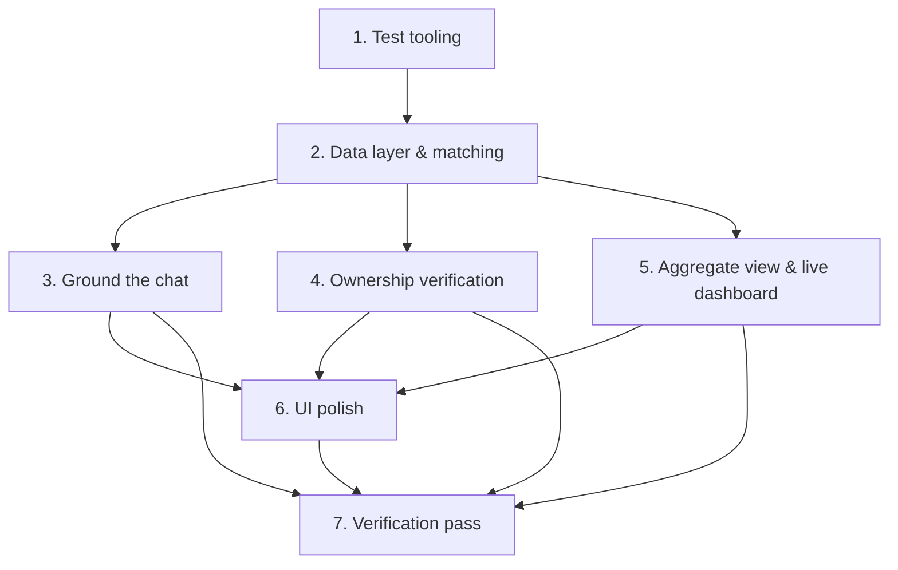

# Implementation Plan – Chat Pipeline Integration

## Overview

This plan grounds the chat assistant in the real intake → store → match pipeline, ports the ownership-verification ("hidden") feature, adds a privacy-friendly aggregate counts view, makes the dashboard update live, and applies a presentation-ready UI polish. Property-based tests (PBT) enforce the correctness properties from the design.

## Task Dependency Graph



```json
{
  "waves": [
    { "wave": 1, "tasks": ["1.1"] },
    { "wave": 2, "tasks": ["2.1", "2.2"] },
    { "wave": 3, "tasks": ["3.1", "4.1", "4.2", "5.1"] },
    { "wave": 4, "tasks": ["3.2", "3.3", "4.3", "5.2"] },
    { "wave": 5, "tasks": ["6.1"] },
    { "wave": 6, "tasks": ["7.1"] }
  ]
}
```

## Tasks

- [x] 1. Set up test tooling and shared helpers
- [x] 1.1 Add a test runner (Vitest) and scripts
  - Install Vitest + config compatible with the Next.js/TS setup; add `test` script to `package.json`.
  - Add a `tests/` location and confirm a trivial test runs.
  - _Requirements: supports all_

- [x] 2. Harden the data layer and matching
- [x] 2.1 Add store helpers and default-safe item creation
  - Add `findItemById`, `markResolved`, and server-only `getExpectedAnswer` to `lib/store.ts`.
  - Update `POST /api/items` to apply defaults (`status:'ACTIVE'`, `category:'Other'`, `priority:'NORMAL'`, `privateAttributes:{}`, `appearanceTags:[]`, `color:null`, `brand:null`) before caller values win.
  - _Requirements: 5.1, 5.2, 5.3, 6.1_
- [x] 2.2 Add confident-match filtering helper
  - Add `MIN_REPORTABLE_SCORE` and `filterConfidentMatches` to `lib/matching.ts`; use it in `/api/match`.
  - **PBT:** every returned match has `score >= MIN_REPORTABLE_SCORE` and results are sorted descending. _(Property 2)_
  - _Requirements: 2.2, 2.3_

- [ ] 3. Ground the chat in the real pipeline
- [x] 3.1 Server-side orchestration in `/api/chat`
  - Inject `RECOVERY_ASSISTANT_PROMPT` server-side; stop trusting the client `systemPrompt`.
  - Run intake extraction (`INTAKE_AGENT_PROMPT`) → normalize to `ExtractedReport` → completeness check.
  - When complete: persist via store, run matching against opposite type, apply `filterConfidentMatches`.
  - Build factual match block from data (deterministic templates); return `{ choices, meta }`.
  - _Requirements: 1.1, 1.2, 1.3, 1.4, 1.5, 2.1, 3.1, 3.2_
- [ ] 3.2 Completeness + grounding guarantees
  - Centralize completeness rule (needs `itemName`, `type`, + one distinguishing detail).
  - **PBT:** for any store with zero opposite-type items, the reported confident-match list is empty and reply contains the "no match yet" message. _(Property 1)_
  - **PBT:** every match shown is an element of the store's opposite-type list. _(Property 3)_
  - **PBT:** a "not ready" report never writes to the store and never claims a match. _(Property 6)_
  - _Requirements: 1.4, 1.5, 2.1_
- [ ] 3.3 Wire client `Chat.tsx` to grounded response
  - Remove inline hardcoded system prompt; read `meta.reportLogged` and dispatch `report-logged` window event.
  - _Requirements: 3.1, 4.1_

- [ ] 4. Ownership verification ("hidden feature")
- [ ] 4.1 Verification helper
  - Create `lib/verification.ts` with `evaluateClaimAnswer(expected, answer)` (tolerant compare, empty → false).
  - **PBT:** returns true iff normalized equal or one contains the other; empty input → false. _(Property 8)_
  - _Requirements: 6.3_
- [ ] 4.2 `/api/verify` and `/api/evaluate` routes
  - `POST /api/verify` returns the public question(s) only, never the expected answer (404 if missing).
  - `POST /api/evaluate` evaluates the answer; on pass `markResolved`, returns `{verified:true}`; on fail no change.
  - **PBT:** verify/items responses never include `expectedAnswer`/`privateAttributes`. _(Property 7)_
  - **PBT:** a passing evaluate resolves exactly one item; a failing one changes nothing. _(Property 9)_
  - _Requirements: 6.2, 6.4, 6.5, 6.6_
- [ ] 4.3 Claim/verify UI
  - Add a claim modal/panel that fetches the question, submits the answer, shows pass/fail with a success animation, and dispatches a `claim-resolved` event.
  - _Requirements: 6.2, 6.3, 6.4, 6.5_

- [ ] 5. Privacy-friendly aggregate view + live dashboard
- [ ] 5.1 Aggregate + stats helpers
  - Add pure `computeStats(items)` and `aggregateByGroup(items)` (returns only `{label,count}` entries).
  - **PBT:** `computeStats` empty → 0% and no throw; `recovered+active <= total`. _(Property 5)_
  - **PBT:** `aggregateByGroup` entries are `{label,count}` only, counts non-negative, sum === items.length. _(Property 10)_
  - _Requirements: 4.2, 4.3, 7.1, 7.2, 7.3_
- [ ] 5.2 Live-updating dashboard + aggregate board
  - Refactor `AdminDashboard` to use `computeStats`; add `AggregateBoard` showing Lost/Found/Resolved counts by label only.
  - Add polling (5s) + listeners for `report-logged` and `claim-resolved`; null-safe category chart.
  - _Requirements: 4.1, 4.2, 4.3, 4.4, 7.1, 7.4_

- [ ] 6. Presentation-ready UI polish
- [ ] 6.1 Cohesive styling pass
  - Establish shared design tokens; polish chat panel, aggregate/analytics board, and claim modal (consistent cards, shadows, radius, subtle motion).
  - Verify no regressions to grounded-match, verification, or live-count behavior.
  - _Requirements: 8.1, 8.2, 8.3, 8.4_

- [ ] 7. Verification pass
- [ ] 7.1 Run full test suite and reproduce-the-bug integration check
  - Run all unit/PBT tests; add an integration test: post one lost item, chat returns `meta.reportLogged===true` with empty confident matches and the "no match yet" message.
  - Run the build/lint and fix any issues.
  - _Requirements: 1.4, 2.1, 4.1_

## Notes

- The atlas repo concept (`hiddenAttributes` + `evaluateClaimAnswer`) is ported onto this project's existing `privateAttributes`, prompts, and stubbed `/api/verify` + `/api/evaluate` routes — concept ported, not code copied (different framework).
- Privacy is a hard constraint: `expectedAnswer` / `privateAttributes` must never reach the client through listings or aggregates (Property 7).
- UI work is validated by visual review; automated tests target pure helpers and API behavior, not pixels.
- The in-memory store does not persist across server rebuilds; acceptable for the hackathon demo.
